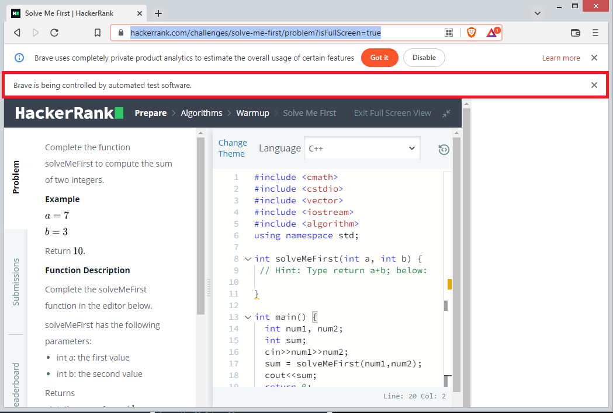

# HackerRank-Automation
This Application is build using Node.JS.Using puppeteer.js, it automates the login into HackerRank and solves all the problems in a particular section.

Applied Javascript Promises to resolve Async events.

# Run
> npm install
> node main.js

## To change the details such as browser location, username and password go to "deatail.js".

## Screenshot:

